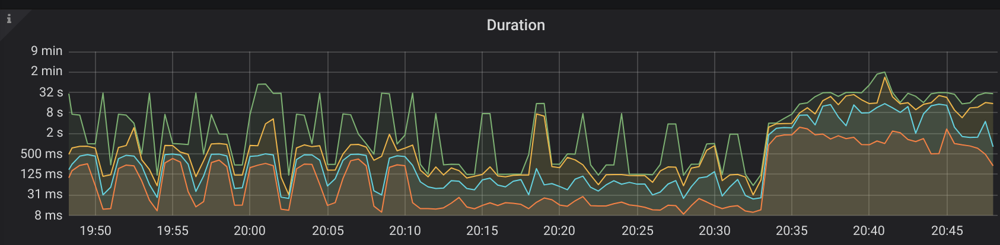
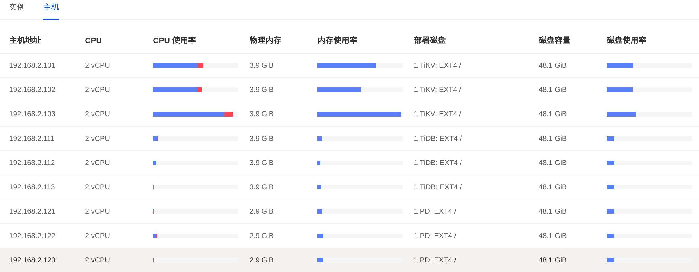

# Week2

## 使用TiUP部署集群

使用了2台物理机，部署了7个配置不同的虚拟机：

 |节点类型 |内存|core|磁盘|节点数|机器IP|
 |----|----|----|----|----|----|
 |PD| 3G   |2   | 50G SSD |3 |192.168.2.111 - 113|
 |KV| 4G   |2   | 50G SSD |3 |192.168.2.101 - 103 |
 |DB| 4G   |2   | 50G SSD |3 |192.168.2.121 - 123 |
 |监控| 1G  |1   | 50G SSD |1 |192.168.2.131 |

集群配置文件`config.yaml`：
```
# # Global variables are applied to all deployments and used as the default value of
# # the deployments if a specific deployment value is missing.
global:
  user: "root"
  ssh_port: 22
  deploy_dir: "/tidb-deploy"
  data_dir: "/tidb-data"

# # Monitored variables are applied to all the machines.
monitored:
  node_exporter_port: 9100
  blackbox_exporter_port: 9115
  # deploy_dir: "/tidb-deploy/monitored-9100"
  # data_dir: "/tidb-data/monitored-9100"
  # log_dir: "/tidb-deploy/monitored-9100/log"

# # Server configs are used to specify the runtime configuration of TiDB components.
# # All configuration items can be found in TiDB docs:
# # - TiDB: https://pingcap.com/docs/stable/reference/configuration/tidb-server/configuration-file/
# # - TiKV: https://pingcap.com/docs/stable/reference/configuration/tikv-server/configuration-file/
# # - PD: https://pingcap.com/docs/stable/reference/configuration/pd-server/configuration-file/
# # All configuration items use points to represent the hierarchy, e.g:
# #   readpool.storage.use-unified-pool
# #      
# # You can overwrite this configuration via the instance-level `config` field.

server_configs:
  tidb:
    log.slow-threshold: 300
    binlog.enable: false
    binlog.ignore-error: false
  tikv:
    # server.grpc-concurrency: 4
    # raftstore.apply-pool-size: 2
    # raftstore.store-pool-size: 2
    # rocksdb.max-sub-compactions: 1
    # storage.block-cache.capacity: "16GB"
    # readpool.unified.max-thread-count: 12
    readpool.storage.use-unified-pool: false
    readpool.coprocessor.use-unified-pool: true
  pd:
    schedule.leader-schedule-limit: 4
    schedule.region-schedule-limit: 2048
    schedule.replica-schedule-limit: 64

pd_servers:
  - host: 192.168.2.121
    # ssh_port: 22
    # name: "pd-1"
    # client_port: 2379
    # peer_port: 2380
    # deploy_dir: "/tidb-deploy/pd-2379"
    # data_dir: "/tidb-data/pd-2379"
    # log_dir: "/tidb-deploy/pd-2379/log"
    # numa_node: "0,1"
    # # The following configs are used to overwrite the `server_configs.pd` values.
    # config:
    #   schedule.max-merge-region-size: 20
    #   schedule.max-merge-region-keys: 200000
  - host: 192.168.2.122
  - host: 192.168.2.123

tidb_servers:
  - host: 192.168.2.111
    # ssh_port: 22
    # port: 4000
    # status_port: 10080
    # deploy_dir: "/tidb-deploy/tidb-4000"
    # log_dir: "/tidb-deploy/tidb-4000/log"
    # numa_node: "0,1"
    # # The following configs are used to overwrite the `server_configs.tidb` values.
    # config:
    #   log.slow-query-file: tidb-slow-overwrited.log
  - host: 192.168.2.112
  - host: 192.168.2.113

tikv_servers:
  - host: 192.168.2.101
    # ssh_port: 22
    # port: 20160
    # status_port: 20180
    # deploy_dir: "/tidb-deploy/tikv-20160"
    # data_dir: "/tidb-data/tikv-20160"
    # log_dir: "/tidb-deploy/tikv-20160/log"
    # numa_node: "0,1"
    # # The following configs are used to overwrite the `server_configs.tikv` values.
    # config:
    #   server.grpc-concurrency: 4
    #   server.labels: { zone: "zone1", dc: "dc1", host: "host1" }
  - host: 192.168.2.102
  - host: 192.168.2.103

monitoring_servers:
  - host: 192.168.2.131
    # ssh_port: 22
    # port: 9090
    # deploy_dir: "/tidb-deploy/prometheus-8249"
    # data_dir: "/tidb-data/prometheus-8249"
    # log_dir: "/tidb-deploy/prometheus-8249/log"

grafana_servers:
  - host: 192.168.2.131
    # port: 3000
    # deploy_dir: /tidb-deploy/grafana-3000

alertmanager_servers:
  - host: 192.168.2.131
    # ssh_port: 22
    # web_port: 9093
    # cluster_port: 9094
    # deploy_dir: "/tidb-deploy/alertmanager-9093"
    # data_dir: "/tidb-data/alertmanager-9093"
    # log_dir: "/tidb-deploy/alertmanager-9093/log"
```

部署集群：
```
tiup cluster deploy tidb-test v4.0.4 config.yaml --user meiyi -p
```


启动集群：
```
tiup cluster start tidb-test
```


查看集群：
```
tiup cluster display tidb-test
```


到这里，集群配置完成。

## 使用Sysbench测试

安装：
```
curl -s https://packagecloud.io/install/repositories/akopytov/sysbench/script.deb.sh | sudo bash
sudo apt -y install sysbench
```

配置文件`sysbench.cfg`(16个线程)：
```
mysql-host=192.168.2.111
mysql-port=4000
mysql-user=root
mysql-password=
mysql-db=test
time=60
threads=16
report-interval=10
db-driver=mysql
```

导入数据(16个表，每个表1M数据)：
```
sysbench --config-file=sysbench.cfg oltp_point_select --tables=16 --table-size=1000000 prepare
```

执行的状态：







数据开始写入的时间是20:32，duration耗时较长，达到32秒。
TiKV节点的压力很大，由于TiDB节点压力较小，把TiDB内存减小1G，TiKV内存增加1G。同时，减少写入数据重新测试。

更新后的集群配置为：
 |节点类型 |内存|core|磁盘|节点数|机器IP|
 |----|----|----|----|----|----|
 |PD| 3G   |2   | 50G SSD |3 |192.168.2.111 - 113|
 |KV| 5G   |2   | 50G SSD |3 |192.168.2.101 - 103 |
 |DB| 3G   |2   | 50G SSD |3 |192.168.2.121 - 123 |
 |监控| 1G  |1   | 50G SSD |1 |192.168.2.131 |

更新后导入数据(8个线程，4个表，每个表5w数据)：
```
sysbench --config-file=sysbench.cfg oltp_point_select --tables=4 --table-size=50000 prepare
```

数据预热与统计信息收集：
```
SELECT COUNT(pad) FROM sbtest1 USE INDEX(k_1);
ANALYZE TABLE sbtest1 ;
...
```

测试：
```
sysbench --config-file=sysbench.cfg oltp_point_select --tables=4 --table-size=50000 run
sysbench --config-file=sysbench.cfg oltp_update_index --tables=4 --table-size=50000 run
sysbench --config-file=sysbench.cfg oltp_read_only --tables=4 --table-size=50000 run
sysbench --config-file=sysbench.cfg oltp_write_only --tables=4 --table-size=50000 run
sysbench --config-file=sysbench.cfg oltp_read_write --tables=4 --table-size=50000 run
```


发现读的QPS比写入高；写入时候比较消耗CPU，读的时候CPU消耗较小，可能是因为数据量很小，全部缓存在内存中。

参考文档：
```
https://github.com/pingcap-incubator/tidb-in-action/blob/master/session4/chapter3/sysbench.md
https://github.com/akopytov/sysbench
```

## YCSB

安装：
```
git clone git@github.com:pingcap/go-ycsb.git
cd go-ycsb
make
```

load数据：
```
./bin/go-ycsb load mysql -P workloads/workloada -p mysql.host=192.168.2.111 -p mysql.port=4000 --threads=8 -p recordcount=200000
```


run：
```
./bin/go-ycsb run mysql -P workloads/workloada -p mysql.host=192.168.2.111 -p mysql.port=4000 --threads=8 -p operationcount=200000
```


## TPC性能测试

安装：
```
git clone https://github.com/pingcap/go-tpc.git
make build
```

TPCC导入数据：
```
./bin/go-tpc tpcc -H 192.168.2.111 -P 4000 -D tpcc --warehouses 1 prepare
```

TPCC测试：
```
./bin/go-tpc tpcc -H 192.168.2.111 -P 4000 -D tpcc --warehouses 1 run --time 1m --threads 4
```


TPCH导入数据：
```
./bin/go-tpc tpch prepare -H 192.168.2.111 -P 4000 -D tpch --sf 1 --analyze
```

TPCH测试：
```
./bin/go-tpc tpch run -H 192.168.2.111 -P 4000 -D tpch --sf 1
```


参考文档：
```
https://github.com/pingcap-incubator/tidb-in-action/blob/master/session4/chapter3/tpc-c.md
```